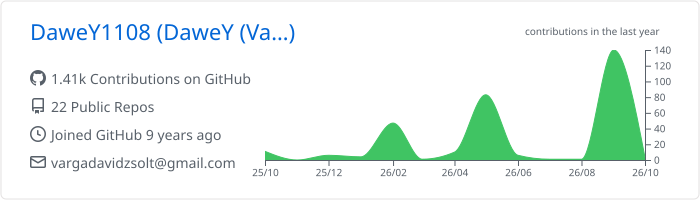
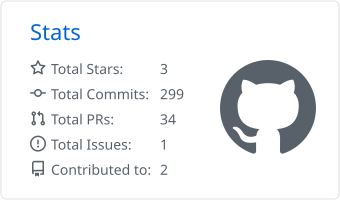
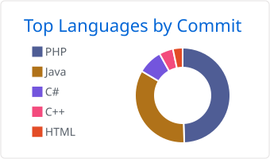

<!-- ═══════════════════════════ HEADER ═══════════════════════════ -->
<p align="center">
  
</p>

<p align="center">
  <a href="https://git.io/typing-svg">
    
  </a>
</p>

<p align="center">
  
  
  <a href="https://linkedin.com/in/vargadavidzsolt"></a>
</p>

---

## 👨‍💻 About Me

I'm **Varga Dávid Zsolt**, a Computer Engineer (BSc) specialized in **web & mobile development**, currently building **industrial-grade software at Andritz Kft.**
I care about code that is **clean, efficient and scalable** — and about turning complex problems into simple, pleasant digital experiences.

After hours I build **custom web applications** and keep up a long-running passion: **Minecraft server plugins** in Java.

```ts
const dawey = {
  name:       "Varga Dávid Zsolt",
  role:       "Software Developer @ Andritz Kft.",
  location:   "Hungary 🇭🇺",
  education:  "BSc Computer Engineering — Web & Mobile",
  learning:   [".NET", "Blazor", "Cloud architecture"],
  sideQuests: ["Custom web apps", "Minecraft plugins (Java)"],
  askMeAbout: ["Web dev", "Mobile apps", "Java plugins"],
  debugging:  "print() first, breakpoints later 😄",
};
```

---

## 🛠️ Tech Stack

**Web & Mobile**

<p>
  
</p>

**Languages**

<p>
  
</p>

**Data & Tools**

<p>
  
</p>

---

## 🚀 What I'm Building

<table>
  <tr>
    <td width="33%" valign="top">
      <h3>🏭 Industrial Software</h3>
      Professional work at <b>Andritz Kft.</b> — reliable software for industrial environments, where stability matters more than hype.
    </td>
    <td width="33%" valign="top">
      <h3>🌐 Custom Web Apps</h3>
      Tailor-made web applications from backend API to responsive UI, built with <b>Node.js, React, TypeScript</b> and more.
    </td>
    <td width="33%" valign="top">
      <h3>🎮 Minecraft Plugins</h3>
      Custom <b>Java</b> server plugins — gameplay mechanics, admin tools and everything in between.
    </td>
  </tr>
</table>

<!--
  📌 Kiemelt repók — cseréld ki a REPO_NEVE részt, és töröld a komment jeleket:

<p align="center">
  <a href="https://github.com/dawey1108/REPO_NEVE">
    
  </a>
  <a href="https://github.com/dawey1108/REPO_NEVE_2">
    
  </a>
</p>
-->

---

## 📊 GitHub Stats

<p align="center">
  <picture>
    <source media="(prefers-color-scheme: dark)" srcset="./profile-summary-card-output/radical/0-profile-details.svg" />
    
  </picture>
</p>

<p align="center">
  <picture>
    <source media="(prefers-color-scheme: dark)" srcset="./profile-summary-card-output/radical/3-stats.svg" />
    
  </picture>
  <picture>
    <source media="(prefers-color-scheme: dark)" srcset="./profile-summary-card-output/radical/2-most-commit-language.svg" />
    
  </picture>
</p>

<p align="center">
  
</p>

<p align="center">
  <picture>
    <source media="(prefers-color-scheme: dark)" srcset="https://raw.githubusercontent.com/dawey1108/dawey1108/output/github-snake-dark.svg" />
    <source media="(prefers-color-scheme: light)" srcset="https://raw.githubusercontent.com/dawey1108/dawey1108/output/github-snake.svg" />
    
  </picture>
</p>

---

## 😂 Meme of the Day

<p align="center">
  
  <br />
  <sub>Freshly fetched from r/ProgrammerHumor · auto-refreshed by a GitHub Action 🤖</sub>
</p>

---

## 🌐 Connect With Me

<p align="center">
  <a href="https://linkedin.com/in/vargadavidzsolt"></a>
  <a href="https://instagram.com/vargadavid108"></a>
  <a href="https://tiktok.com/@vdave1108"></a>
  <a href="https://pinterest.com/vargadavidzsolt"></a>
  <a href="https://reddit.com/user/Beautiful_West328"></a>
</p>

<p align="center">
  <a href="https://paypal.me/vdave1108"></a>
</p>

<p align="center">
  
</p>

<p align="center">
  
</p>
